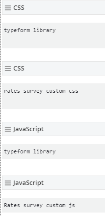

# Hot to inset a custom typeform survey.
## Case rates table and chart



1. Insert a javascript widget into the sitefinity page linking to the typeform javascript library (//embed.typeform.com/next/embed.js) droped at the end of the body.
2. Insert a css widget into the sitefinity page linking to the typeform css library (//embed.typeform.com/next/css/popover.css). 
3. Insert a javascript widget into the sitefinity page with the custom javascript for the corresponding survey droped at the end of the body.
4. Insert a css widget into the sitefinity page with the custom css for the corresponding survey.

**The order of the widgets is important. First we have to insert the oficial libraries (javascript and css) and later the custom javascript and CSS**
**Also important that the javascript widgets (official library and custom javascript) have to be droped at the end of the body**

### Custom Javascript explanation

```
const global = {
    formId: 'xiCUyUr0',
    storageKey: 'survey:rates-chart',
    surveyIsSubmitted: 'survey-is-submitted',
}

const getSurveyData = () => {
    const surveyData = localStorage.getItem(global.storageKey)
    return surveyData ? JSON.parse(surveyData) : {}
}

const setSurveyData = (data) => {
    localStorage.setItem(global.storageKey, JSON.stringify(data))
}

const createSurveyElements = () => {
    const surveyData = getSurveyData()
    const options = {
        height: 'calc(100% - 195px)',
        width: 'calc(100% - 32px)',
        buttonColor: '#e4871b',
        tooltip: "Tell us what you think about the new Chart",
        onSubmit: () => {
            surveyData[global.surveyIsSubmitted] = true;
            // Save in localstorage that the survey has been submited
            setSurveyData(surveyData)
        },
    }

    const { toggle } = window.tf.createPopover(global.formId, options)
}

const surveyLaunch = () => {
    const surveyData = getSurveyData()
    const surveyIsSubmitted = Boolean(surveyData[global.surveyIsSubmitted])
    if (!surveyIsSubmitted) createSurveyElements()
        // We only init the survey if the survey has not been submitted yet

}

window.onload = () => {
    surveyLaunch()
}
```